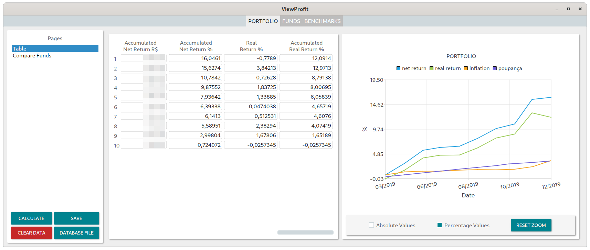
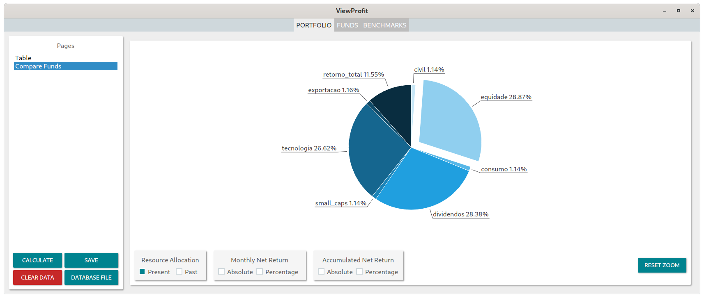

# ViewProfit

A simple program that helps to track investments profit. At this moment it is focused on funds. But this may change in
the future.




# Features

- Fund tables
- Benchmark tables (inflation, etc)
- Portfolio table
- Fund comparison

# Compilation

Inside the source code folder run:

```
meson build
cd build
ninja
```

The executable will be inside `build/src`
